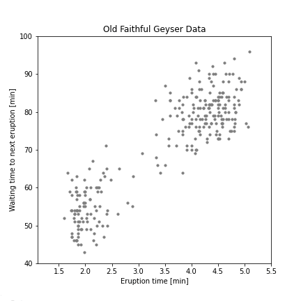

# Expectation Maximization for Gaussian Mixtures

The figure above demonstrates Expectation Maximization (EM) for Gaussian Mixtures on the *Old Faithful* dataset. *Old Faithful* is a famous geyser in Yellowstone National Park, US. 

Plotting the waiting time between eruptions over eruption time reveals a "cluster" structure. In this project I model this structure with a Gaussian Mixture Model. 